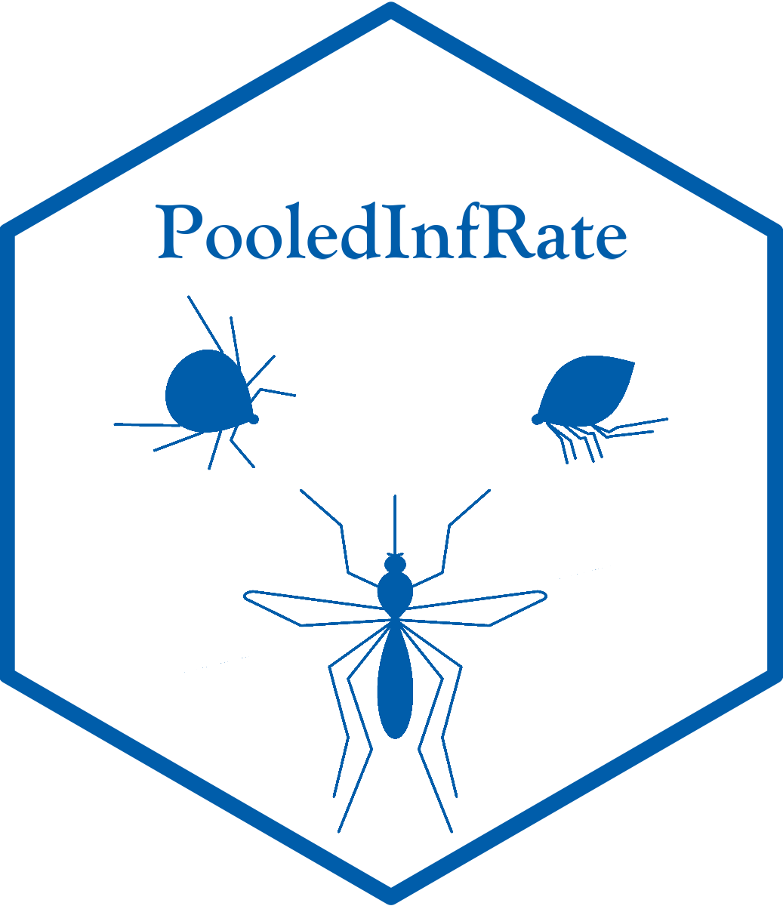

<!-- README.md is generated from README.Rmd. Please edit that file -->

#  PooledInfRate

PooledInfRate: Estimation from pooled or group testing.

Current version: 1.6

The website for this project is
<https://github.com/CDCgov/PooledInfRate>.

PooledInfRate is an [R](www.r-project.org) package that includes
functions to estimate proportions from pooled or group testing data.
There is also functionality to estimate differences of such proportions.
Finally, for entomologists, there is functionality to compute the
so-called “Vector Index” used to quantify the level of pathogen in
vector species, such as the amount of West Nile virus in a population of
vector mosquitoes.

## Installation

You can install PooledInfRate from GitHub:

``` r
# To install from GitHub
# This will build on the fly, so you need *RTools* (available from CRAN)
Sys.setenv(R_QPDF="true") # to build the vignette during the package build
library(devtools) # need to install this if you do not have it
devtools::install_github("https://github.com/CDCgov/PooledInfRate",build_vignettes = TRUE)
```

For those on Microsoft Windows, the binary build for version \#.# is
available in the file list as PooledInfRate\_#.#.zip, and you can
download and install that instead of the build-install. The various
versions are available for Windows, as stored here.

## Example

A couple of basic examples with contrived data:

``` r
library(PooledInfRate)
## basic example code
x <- c(1,0,0,0)
m <- c(50,25,10,5)
pooledBin(x,m)
#>            P        Lower      Upper
#> 1 0.01257911 0.0007261606 0.07828496

pool.dat <- data.frame(Pos = c(1,1,0,0), PoolSize = c(100,50,25,10), NumPools = c(5,8,2,3))
pooledBin(Pos ~ PoolSize, data = pool.dat)
#>            P       Lower      Upper
#> 1 0.01602751 0.002879876 0.08708547
pIR(Pos ~ PoolSize + n(NumPools), data = pool.dat) # pIR is just a short name for 'pooledBin'
#>            P        Lower       Upper
#> 1 0.00212917 0.0003860092 0.007107271
```

See the package vignette for detailed examples of the methods and user
interface, along with references for the methods.

## Public Domain Standard Notice

This repository constitutes a work of the United States Government and
is not subject to domestic copyright protection under 17 USC § 105. This
repository is in the public domain within the United States, and
copyright and related rights in the work worldwide are waived through
the [CC0 1.0 Universal public domain
dedication](https://creativecommons.org/publicdomain/zero/1.0/). All
contributions to this repository will be released under the CC0
dedication. By submitting a pull request you are agreeing to comply with
this waiver of copyright interest.

## License Standard Notice

The repository utilizes code licensed under the terms of the Apache
Software License and therefore is licensed under ASL v2 or later.

This source code in this repository is free: you can redistribute it
and/or modify it under the terms of the Apache Software License version
2, or (at your option) any later version.

This source code in this repository is distributed in the hope that it
will be useful, but WITHOUT ANY WARRANTY; without even the implied
warranty of MERCHANTABILITY or FITNESS FOR A PARTICULAR PURPOSE. See the
Apache Software License for more details.

You should have received a copy of the Apache Software License along
with this program. If not, see
<http://www.apache.org/licenses/LICENSE-2.0.html>

The source code forked from other open source projects will inherit its
license.

## Privacy Standard Notice

This repository contains only non-sensitive, publicly available data and
information. All material and community participation is covered by the
[Disclaimer](https://github.com/CDCgov/template/blob/master/DISCLAIMER.md)
and [Code of
Conduct](https://github.com/CDCgov/template/blob/master/code-of-conduct.md).
For more information about CDC’s privacy policy, please visit
[http://www.cdc.gov/other/privacy.html](https://www.cdc.gov/other/privacy.html).

## Contributing Standard Notice

Anyone is encouraged to contribute to the repository by
[forking](https://help.github.com/articles/fork-a-repo) and submitting a
pull request. (If you are new to GitHub, you might start with a [basic
tutorial](https://help.github.com/articles/set-up-git).) By contributing
to this project, you grant a world-wide, royalty-free, perpetual,
irrevocable, non-exclusive, transferable license to all users under the
terms of the [Apache Software License
v2](http://www.apache.org/licenses/LICENSE-2.0.html) or later.

All comments, messages, pull requests, and other submissions received
through CDC including this GitHub page may be subject to applicable
federal law, including but not limited to the Federal Records Act, and
may be archived. Learn more at <http://www.cdc.gov/other/privacy.html>.

## Records Management Standard Notice

This repository is not a source of government records, but is a copy to
increase collaboration and collaborative potential. All government
records will be published through the [CDC web
site](http://www.cdc.gov).

## Disclaimer

This package/application is provided without warranty of any kind.

While every effort has been made to ensure that that routines provide
correct and accurate results, all responsibility for the use of the
results belongs to the user.
